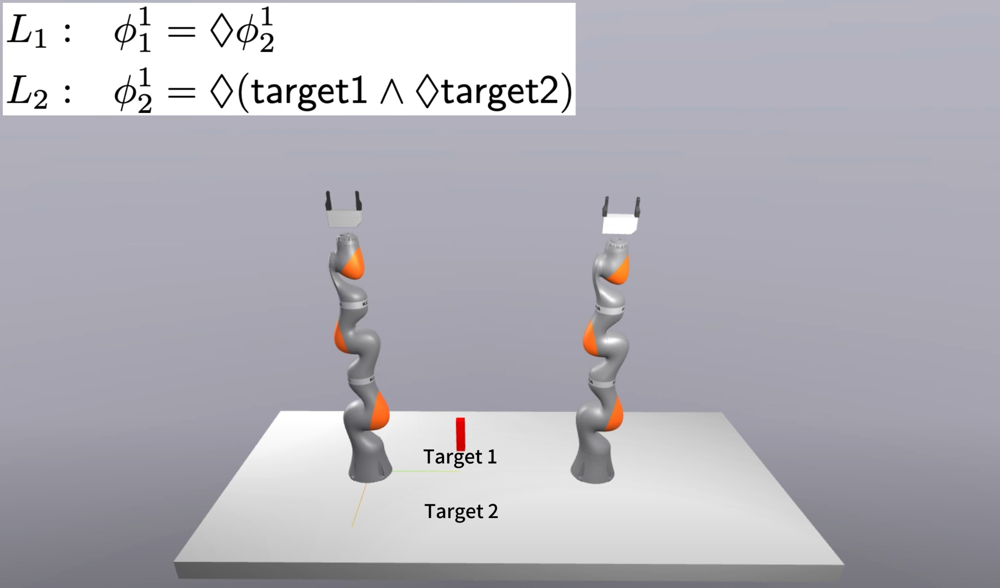
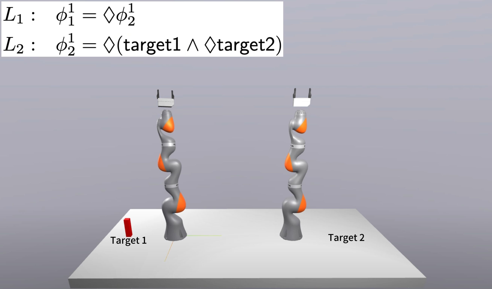
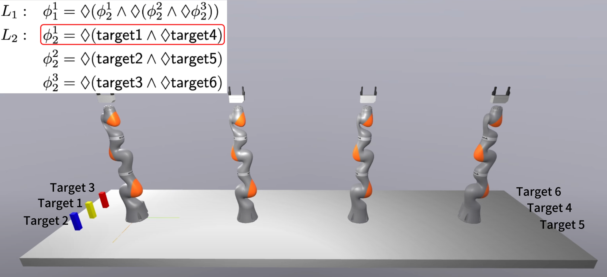
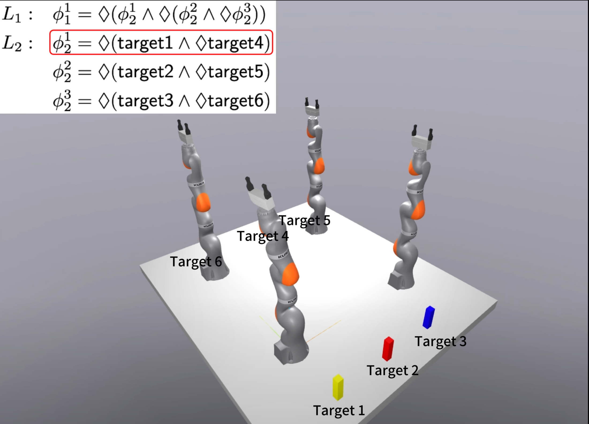
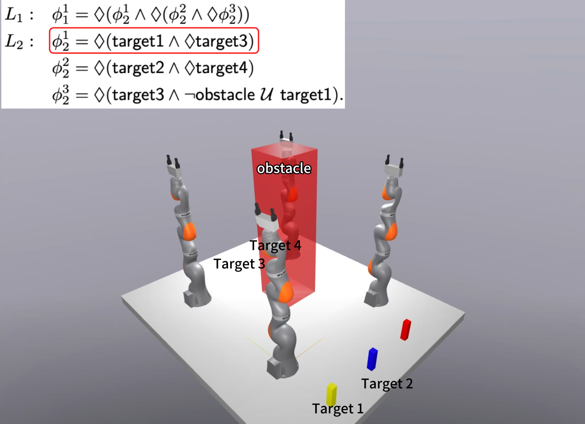
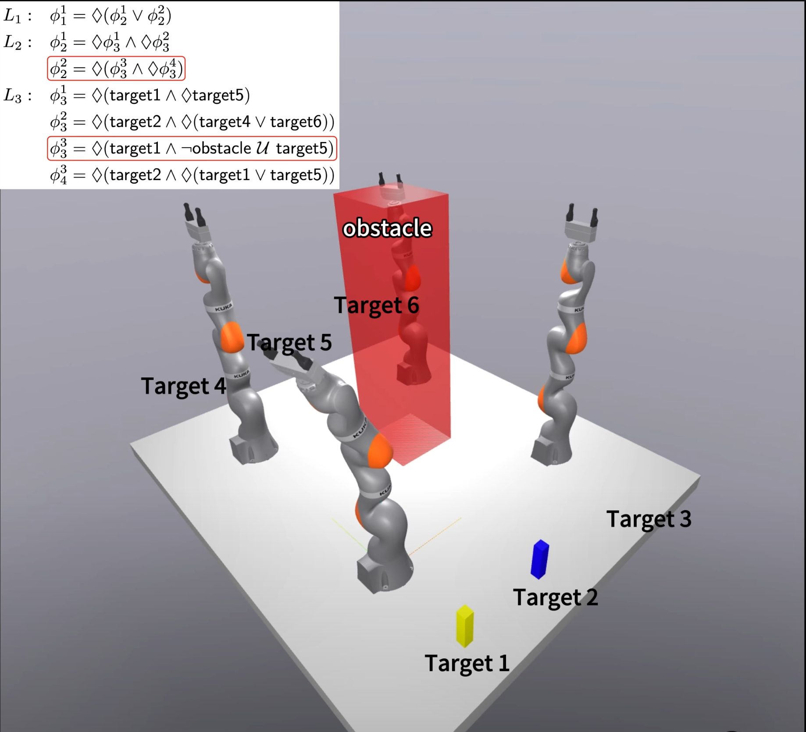
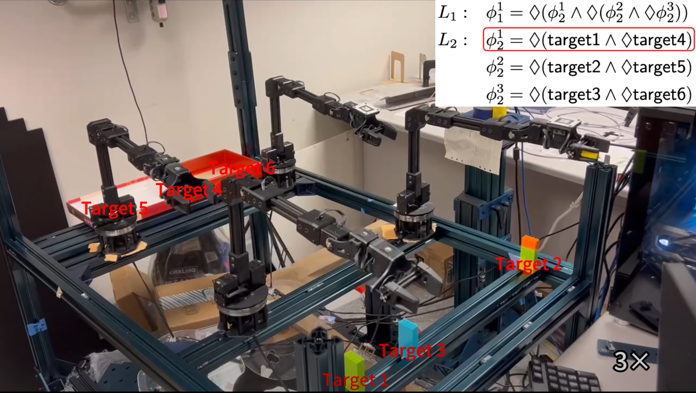
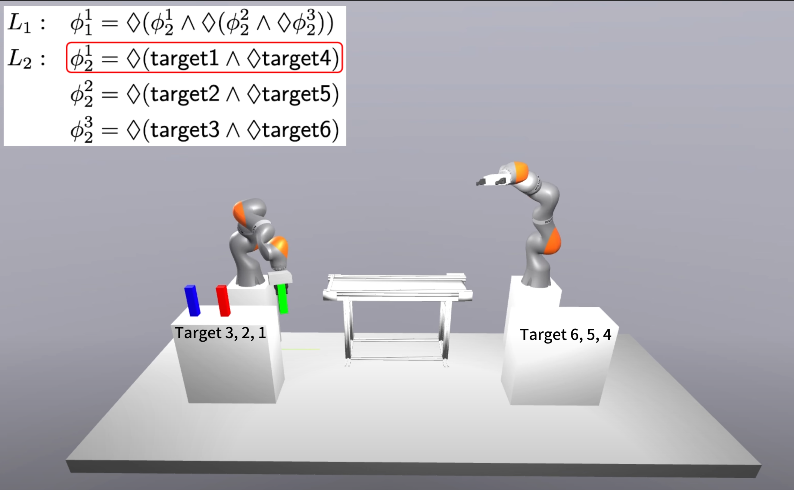
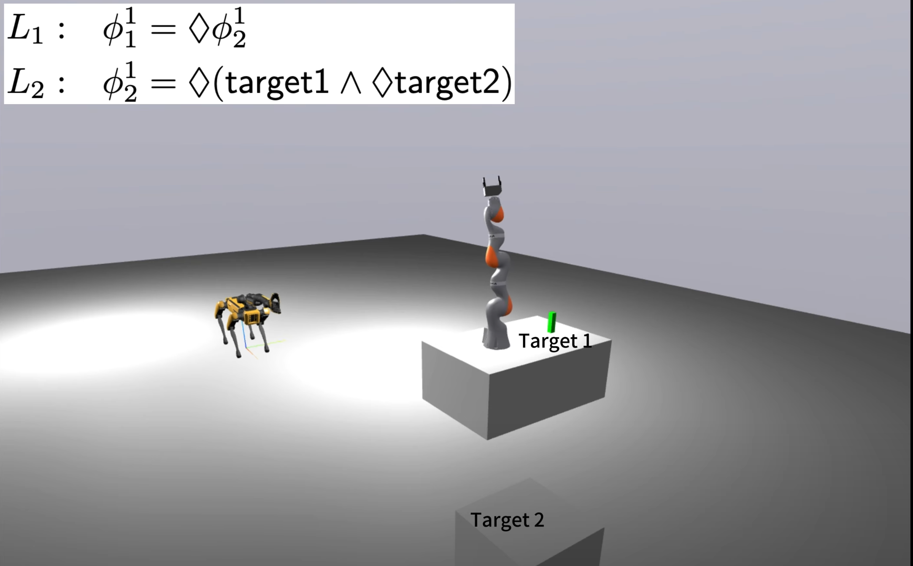
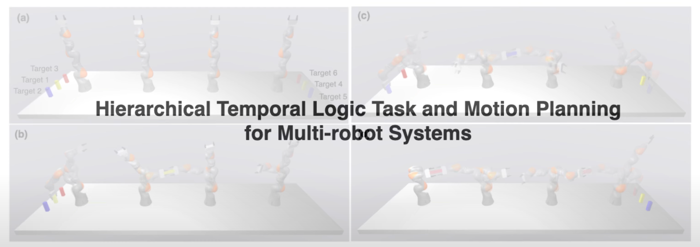

# Task_Motion_Planning_with_HLTL_and_GCS

A fast and scalable task and motion planning framework for tasks expressed in Hierarchical Linear Temporal Logic (H-LTL). 

This repository contains code to accompany the paper [*Hierarchical Temporal Logic Task and Motion Planning for Multi-Robot Systems*](https://arxiv.org/abs/2504.18899) by Zhongqi Wei, Xusheng Luo and Changliu Liu. 

## Installation

Make sure all dependencies are installed, then:

```
$ git clone https://github.com/intelligent-control-lab/Task_Motion_Planning_with_HLTL_and_GCS.git
$ cd Task_Motion_Planning_with_HLTL_and_GCS
$ pip install .
```

## Dependencies

- [Drake](https://drake.mit.edu/)
- [MONA](https://www.brics.dk/mona/download.html)
- [ltlf2dfa](https://github.com/whitemech/LTLf2DFA)
- [MOSEK](https://www.mosek.com/) (license only)

Of these, only MONA and MOSEK require special consideration: all others can be
installed with `pip`. For MOSEK, you only need a valid license: MOSEK itself is
installed along with Drake. 

## Examples

The following examples and several other can be found in the `examples`
directory. Please check the paper [*Hierarchical Temporal Logic Task and Motion Planning for Multi-Robot Systems*](https://arxiv.org/abs/2504.18899) for detailed description of those examples.

1. two-robot motion planning:`examples/1_two_robot_case1.py`

   
   
3. two-robot handover:`examples/2_two_robot_case2.py`

    
    
4. four-robot handover (scenario 1):`examples/3_four_iiwa_linear_case.py`

    
    
5. four-robot handover (scenario 2):`examples/4_four_iiwa_rectangular_case.py`

   
   
7. four-robot handover with obstacle (scenario 3):`examples/4_four_iiwa_rectangular_complex_case1(obstacle).py`

   
   
8. four-robot handover (scenario 4):`examples/4_four_iiwa_rectangular_complex_case1(obstacle)1.py`

   

9. four-wx200 robots handover:`examples/5_four_wx200_rectangular_case.py`

   

10. two-robots with conveyor:`examples/6_two_iiwa_conveyor_case.py`

   

11. Spot-robot handover:`examples/7_iiwa_spot_handover_case.py`

   

## Video
[](https://www.youtube.com/watch?v=FPTLGm5iigc)
